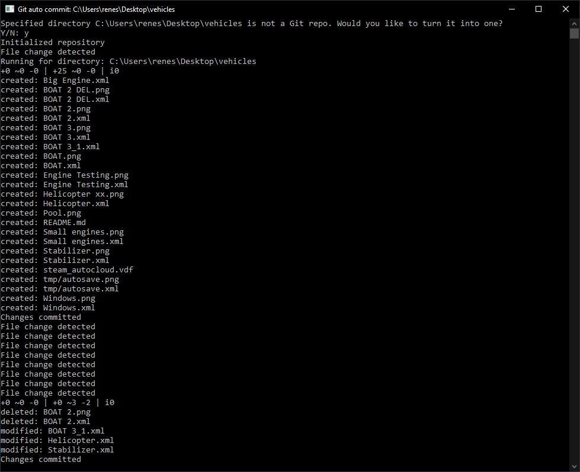
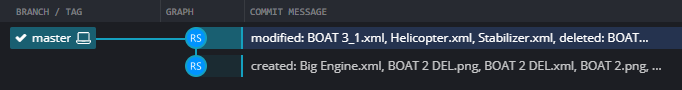

# GitAutoCommit

A simple application that will watch a directory for changes and automatically commit them to a Git repository.

I made this to have a way of restoring old (or accidentally overwritten) saves for vehicles for the game [Stormworks](https://store.steampowered.com/app/573090/Stormworks_Build_and_Rescue/), after I accidentally overwrote a pretty big creation, and I don't want it to happen again.

## Functionality

The application watches for file creation, modification, rename and deletes in the specified directory.

When something has changed, it will wait for 5 seconds (to make sure no other changes are being made in a short time). Then it will auto generate a commit message for the changed files and commit it.




## Usage

```
Usage:
  GitAutoCommit [options]

Options:
  --author-name <author-name>    The Git commit author name
  --author-email <author-email>  The Git commit author email
  --path <path>                  The path to the directory to monitor and commit in
  --version                      Show version information
  -?, -h, --help                 Show help and usage information
```

I recommend creating a .bat file next to the GitAutoCommit.exe file, like so:
```
@echo off
start "" ".\GitAutoCommit.exe" --author-name "Your Name" --author-email "yourgitemail@example.com" --path "C:\path\to\directory"
```